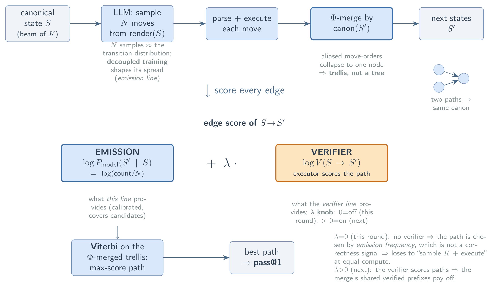

# 解码模型:trellis 解码 = 发射 × verifier(以及 λ 的语义)

这一页是 emission 线和 verifier 线的共同语言锚点。它只讲**一张图**:把大模型的逐步生成套成一个 trellis(网格),在上面做全局解码;发射(本线)和 verifier(姊妹线)各管图里的一项,λ 是它们的配比。代码对应见末尾。



上图是整张结构的一页速览:一个 trellis 步(从 canonical 状态 S 采 N 个 move、执行、Φ 按 canon 合并成下一层状态)→ 每条边的分数 = 发射项 + λ·verifier 项 → Viterbi 在合并 trellis 上选最优路径 → pass@1。下文逐节展开。

## 1. 从自回归解码到 trellis

**正常自回归解码**:外层 `for t = start..end`,每个 t 一次发射,上下文 = `prompt + 输出[0..t-1]`,取一个 token(greedy)或采一个(sampling)。**单条路径,永不分叉——是一棵树。**

**trellis 解码**:注意 **t 不是 token,是一个推导步 / 语义层**。外层 `for t`(层),内层 `for S in B_{t-1}`(上一层存活的 beam 状态集)。对每个状态 S:

```
context = render(S)                      # 从规范状态 S 重新起头,不带杂乱表面历史
samples = sample(context, N, T)          # 采 N 条续写(本线提供的发射)
{S'} = { Φ(c) for c in samples }         # 解析成 move、执行、用 Φ 归并成规范后继状态
```

**命门在 Φ 这一步的合并**:因为只带 canonical 的 S 重新 prompt、再把后继状态用 `canon` 归一,两条"措辞不同但意义相同"的路径在这一层就并到同一个节点上(trellis 有菱形)。正常 AR 解码带逐字历史,这两条永不合并(树)。**trellis 比 greedy 多出来的东西,全靠这个合并**——这是 `state-emission` 里那个"按意义合并的 Φ"在解码侧的对应物。

代价:从"1 × token 数"次前向,变成"层数 × beam 宽 K × N"次前向。这是拿算力换质量。

## 2. 一条边的分数:发射项 + λ·verifier 项

节点 S(第 t-1 层)到后继 S'(第 t 层)的边分,示意:

$$\text{score}(S\to S') = \underbrace{\log P_{\text{model}}(S'\mid S)}_{\textbf{发射(本线)}} \;+\; \lambda\cdot \underbrace{\log V(S\to S')}_{\textbf{verifier(姊妹线)}}$$

- **发射项**:模型从 S 出发给 S' 压了多少质量,由 N 个样本经 Φ 归并后估出。**decoupled 训练塑造的就是这一项**——证据足时尖、不足时铺开、且相对权重可信(而非 one-hot 塌成单尖峰)。
- **verifier 项**:SAVI 的 SymPy / 执行器判这一步合不合法、状态对不对(等价变换是否成立 / 代码是否跑通)。硬 verifier = `V ∈ {0,1}`,把非法后继直接删掉。

Viterbi / beam 在这张加权 trellis 上找累计分最高的整条路径。

## 3. λ 的语义,以及 edge_mode

**λ 控制 verifier 介入多深**:

| 设定 | 含义 | 代码 |
|---|---|---|
| **λ = 0** | verifier **关掉**。边分只剩发射项;选路完全靠模型自己的发射权重。**发射隔离测试用这个。** | `savi(..., verifier=False)`(默认) |
| **λ → ∞** | 硬约束:非法后继整条剪掉。verifier 成为可行性 mask。 | `savi(..., verifier=True)` —— 用 `domain.solvable(S')` 剪枝 |

**edge_mode 决定发射项怎么进分数**(与 λ 正交):

| edge_mode | 边权 | 用途 |
|---|---|---|
| `support` | 恒 0 | 纯可达 / 覆盖(发射只贡献"有没有这条边") |
| `freq` | `log(count / N)` | **发射加权 Viterbi**:路径分 = Σ log(发射频率)。λ=0 想要的就是这个 |

所以 **"只做 forward pass、λ=0 的发射加权 Viterbi" = `savi(verifier=False, edge_mode="freq")`**。

> ⚠️ **λ=0 的退化**:没有 verifier 的 transition 耦合,逐层之间不耦合,Viterbi 退化成**逐层各自取众数**。单答案任务(只有一层)时,这恰好 = **语义自一致(self-consistency)**。所以 λ=0 的 trellis,DP 这个壳相对自一致没多挤出东西——它测的是"去尖化、Φ-合并的发射,值不值",不是"路径"。要让路径真正起作用、并避免逐层独立挑出全局不合法的拼接,需要 λ>0。

## 4. 四条 arm 与各自的天花板

| arm | 做什么 | 代码 | 对应天花板 |
|---|---|---|---|
| **greedy** | 采 1 条整链(T=0),执行,看是否到目标 | `decode.greedy` | 地板 |
| **self-consistency** | 采 N 条,Φ 归并,取众数状态 | = `savi(verifier=False)` 单层等价 | **emission 能够到的**(GSM8K +0.09) |
| **savi (λ=0)** | 在 Φ-合并 trellis 上发射加权 Viterbi | `savi(verifier=False, edge_mode="freq")` | 同上,多层时 ≥ SC |
| **best_of_k** | 采 K 条整链,任一到目标即算中 | `decode.best_of_k` | **oracle 选择**(GSM8K +0.18,需 verifier 兑现) |
| **oracle** | 绝对可解性上限 | `decode.oracle` | 余量分子 |

**头部余量分解**(GSM8K base:greedy 0.735 → SC 0.825 → oracle-best-of-16 0.915):

- `+0.09`(0.735→0.825):**采样 + 投票/Φ-合并就能拿到**,纯发射的领地。
- 另 `+0.09`(0.825→0.915):**"正确答案在 16 条里、但不是多数",只有 verifier(λ>0)能救**,姊妹线的领地。

采样造出整块 `+0.18` 的**潜力**(coverage);λ=0 兑现头一半,verifier 兑现后一半。**所以 λ=0 的实验,正确的判定线是"打败 self-consistency",不是"逼近 +0.18"**——后者按定义不归发射管。decoupled 还顺带抬高 +0.18 这个天花板本身(coverage 是发射属性,one-hot 采样塌掉时它的 best-of-N 天花板更低)。

## 5. 和 speculative decoding 的关系

骨架相同("先提议、后验证"),但两根轴相反:

| | speculative decoding | SAVI trellis decode |
|---|---|---|
| 谁是 ground truth | **大模型自己的分布**(verifier 服从模型,只为复现 target 分布而接受/拒绝) | **外部正确性 oracle**(SymPy/执行器;模型服从 verifier,被往正确拽) |
| 买什么 | **速度**(质量不变),花更少串行前向 | **质量**(找回 greedy 漏掉的正确答案),花更多算力 |
| 路径 | 单条 | 一整张合并 trellis |
| 对"尖" | **依赖且保留尖**(draft≈target、都尖时接受率高) | **故意破尖**(calibrated 多峰),好让 beam 有多候选可比 |

最后一行最本质:**speculative 吃尖,我们破尖。** 一个尖到只剩单候选的发射,给 beam 的就是 `marginal-vs-path` 那个"Viterbi≈marginal"的空集。

## 6. 代码对应(`verifier-decode/decode_core`)

- `domain.py` —— Domain 接口:`canon`(=Φ 合并键)、`apply`、`parse_move`/`parse_chain`、`is_goal`、`solvable`(=verifier mask / 可解性 oracle)、`render`。
- `decode.py` —— `savi(domain, sample, inst, K, N, edge_mode, tau, seed, verifier=False, max_depth=None)`,以及 `greedy` / `best_of_k` / `oracle`。Φ-合并 = 按 `canon(S')` 归并、留累计分高者。
- 发射接口 `sample(state, N, temperature, seed, mode) -> list[str]`,`mode ∈ {"step","chain"}`。**这是本线要填的口子**:algebra 域里 `algebra_sampler.py` 的 `real_onehot`/`real_decoupled` 目前 `raise NotImplementedError("emission line dependency")`。

一句话收束:**发射(本线)= 在每个 (t, S) 上产出权重可信的多峰候选集;verifier(姊妹线,λ 旋钮)= 把候选朝正确剪枝/重排;Viterbi = 在合并 trellis 上选整条最优路径。** λ=0 测纯发射(尺子 = 自一致),λ>0 测发射+verifier 的合体(尺子 = oracle +0.18)。
