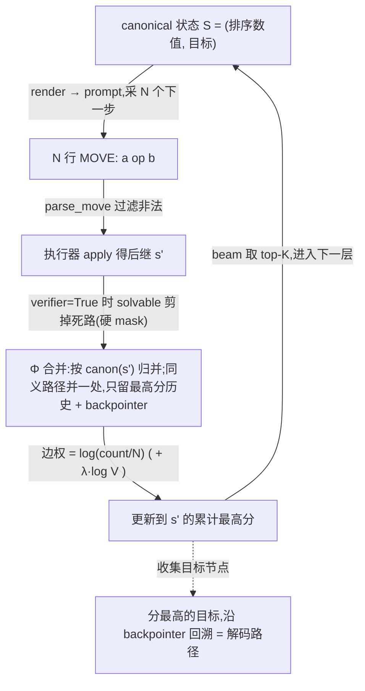
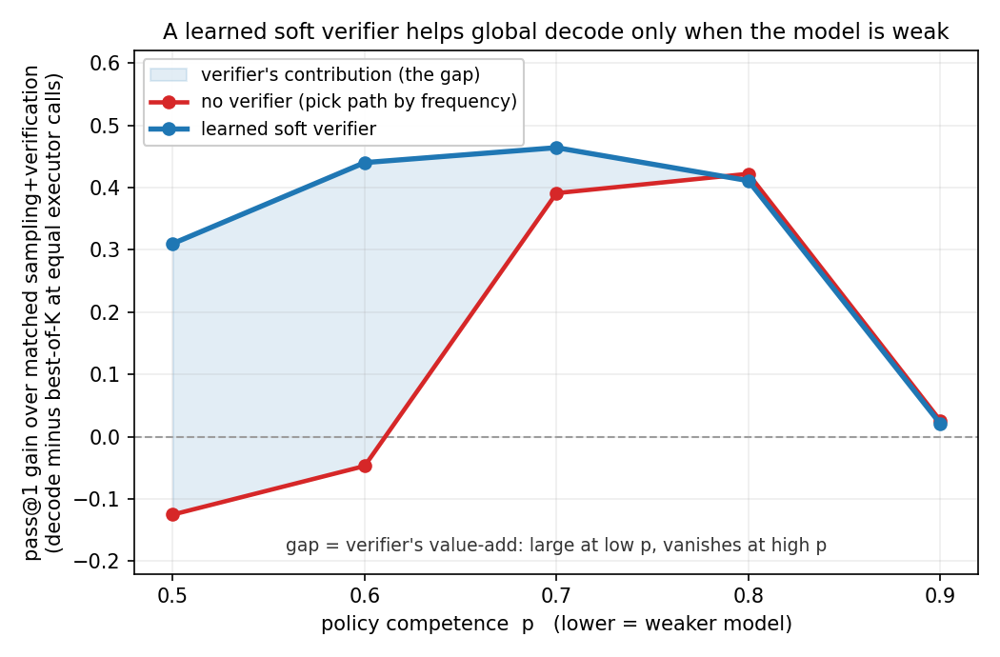
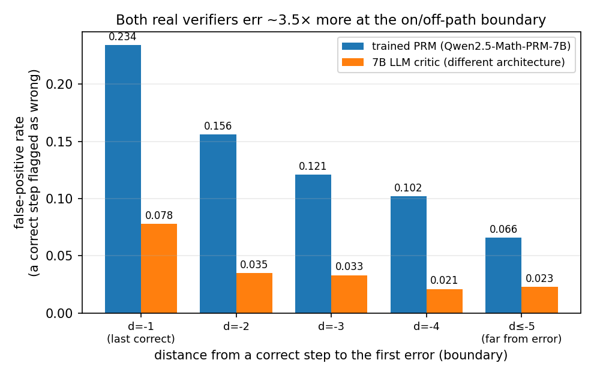

# 接上 verifier:公平比较(算力对齐)下,全局解码还解不出"采样+验证"解不出的题

**CountDown 看不出问题;换到能分辨的测试后,卡点在生成器、不在解码。**

> 这是对上一条建议("在一个小的可执行任务上,用 decoupled 模型采 N 条候选、执行器作 Φ、接 λ=0 的 Viterbi,报 greedy vs decoupled+SAVI 的 pass@1;增益接近 headroom 就说明 pipeline 成立")的回复。
> 我们把这个实验做了,又把 verifier 真正打开(λ>0)、并推到几个能看清问题的任务上。结论和那条建议预期的不太一样,但我认为更有用:**"比 greedy 高 +0.18"会误导**——一旦把验证信号公平地也给采样基线,在 CountDown 这种任务上就看不出"全局解码到底比采样多做了什么"。需要换任务才看得清。下面先把解码的具体做法对照代码讲清楚,再把要回答的问题定清楚,然后说为什么 CountDown 答不了,最后用两个能答的可控任务给完整结论。
> 配套代码/结果目录见文末表。所有数字都能追到对应 `results.json`。

## 摘要

要回答的不是"全局解码比 greedy 好不好"(它好:CountDown 上 pass@1 从 0.08 到 0.38),而是更严的问题:**算力对齐下,全局解码能不能解出"采样+验证"(多采几条链 + 执行器逐条判定)在任何可行预算下都解不出的题——即"从不能到能"。** 跨五个任务,答案是**没有**:看上去全局解码独有的优势,核对后都是省算力、或在已可达答案里挑得更准、或被一个近乎精确的"逐步可行性检查"承载(与全局解码本身无关)。最有希望的一条——"跨采样拼成采样自己采不到的稀有正确路径"——在合成任务上成立,但搬到真实自回归生成就不发生(§5.2、§6)。

**目前站得住的正面结果**是:模型很弱时,用一个学到的、不完美的 verifier 做**软性降权**(而非硬剪枝),比采样+验证更省算力地挑对答案(+0.29…+0.34,且扛得住真实 verifier 的误差几何)——但这在合成任务、按执行次数对齐,性质是省算力,不是"从不能到能"。**我理解的结论:标准自回归生成上,用现实可得的 verifier,verifier-decode 没有"解出采样+验证解不出的题"的能力;真正的卡点是生成器的片段覆盖,不是"解码还是选择"。**

---

## 1. 我们具体怎么解码(对照代码实现)

核心解码器是 `verifier-decode/decode_core/decode.py` 的 `savi()`(domain 无关),真实 Countdown 采样后端是 `countdown-decode/core/real_backend.py`。同一套机制在 Countdown 和后面的 lattice 上通用,只换生成器(真实 LM / 参数化采样器)和 verifier(执行器硬 mask / 学到的软 value)。trellis 一层一层建,每层的流程:

五个容易模糊的点,对照上图:

- **canonical 上下文**:prompt 只由 `canon(state)=(排序数值,目标)` 渲染、**不带文字历史**,所以同一语义状态拿到逐字相同的 prompt(Markov);种子按 `canon` 混入,每个状态有独立随机流。
- **N 采样 × decouple**:模型写 `MOVE:` 行、不吐 logits;decouple 让 N 次采样落到几个**不同**合法 move(多峰),one-hot 则塌成一个 → beam 不分叉 → 退化 greedy。
- **Φ 合并**:`apply` 得后继,按 `canon(s')` 归并;不同历史撞同一 canon 就合一、只留高分那条(Countdown 实测每层 89→17)。
- **边打分**:发射项 `log(count/N)`(λ=0 只有这项)+ verifier 项;本核心 verifier 是**硬 mask**(`solvable` 剪枝),软 `λ·log V` 加权是 §5.1 的变体。
- **backtrack**:从分最高的目标节点沿 backpointer 回溯;合并时只留最高分指针 → 胜出指针可能来自**不同父节点** → 回溯出的路径可跨采样拼接、没有任何单次采样完整产生过(就是 §5.2 的"拼接"机制)。greedy / 单次采样没有回溯 + 合并,错了无法回头。

---

## 2. 对合理基线的理解

**greedy 不是公平的对手。** greedy 只采一条链、一步选错就一路错到底,所以"比 greedy 高"几乎是必然的。但在能执行验证的任务上,本来就能多采几条链、用执行器逐条判定、命中即采纳——这条**采样+验证**(best-of-K)的基线几乎白拿了验证信号,通常很强。所以把成功线设在"比 greedy 高 +0.18"会高估:真正该比的对手是采样+验证,而且要**在两边花一样多算力时**比。

**我们真正想知道的是"从不能到能"。** 也就是:算力对齐后,全局解码能不能解出采样+验证在任何可行预算下都解不出的题。这要分成两个层面,后面会反复用到:

- **路径(path)级**:指一条具体的解题路径——从初始状态到答案的整条步骤序列。"采样采不到这条路径"= 随机采样在可行预算内几乎不可能恰好生成这一条特定的步骤序列。
- **整题(instance)级**:指一道题本身。"采样解不开这道题"= 随机采样在可行预算内几乎不可能产生**任何一条**到达正确答案的路径。

两者的区别是关键:**一道题通常有很多条正确路径。** 某一条特定路径采样采不到(路径级做不到),但只要还有别的正确路径采样采得到,这道题采样照样能解(整题级做得到)。只有当一道题**全部**正确路径加起来的总概率都极小时,整题级才是一堵真墙。

**全局解码相对 greedy,原理上"能多做什么"。** greedy 早早押定一条路、错了无法回头;全局解码是在把同义路径合并后的图上,比较**整条**路径的得分来选,而且能把不同采样里各自正确的片段拼接成一条**没有任何单次采样完整产生过**的路径(机制就是 §1(5) 的 backtrack + 合并)。这是它原理上能做、而 greedy 和单次采样做不到的事。本报告要验证的,就是这件事在公平算力下是否真的发生,以及它到底是"省了点算力"还是真的撞到了采样的墙。

---

## 3. 为什么 CountDown(把验证公平地给两边之后)看不出这件事

**设置：** frozen Qwen3-4B + 小 LoRA, 精确执行器既作 Φ(把表面不同、意义相同的中间状态合并成同一个规范状态)、又作判定(终态是否等于目标)。在 held-out 题上报 pass@1(与训练用不同随机种子生成、模型没见过)。

### 3.1 λ=0(只按发射频率选路):比 greedy 好,但算力对齐后输给采样+验证

先按上一条建议跑 λ=0 的 Viterbi(只用发射频率选路、不打开验证)。它确实把 greedy 抬得很高,也在**采样条数相同**时比 self-consistency 好(self-consistency = 采 N 条、按多数投票)。这里"逐题比较(配对)"指:在同一批题上一道题一道题地比 savi 和对手谁解开了,统计差值与置信区间。

| 方法(decoupled,61 道 held-out) | 怎么用 16 条采样                               | pass@1         |
| ------------------------------ | ---------------------------------------------- | -------------- |
| greedy                         | 1 条链                                         | 0.08           |
| self-consistency               | 16 条链,多数投票                               | 0.13           |
| **savi(λ=0 全局解码)**  | beam K=8,每状态采 16 个后继,按发射频率选整条路 | **0.38** |

逐题配对比较:savi 比 self-consistency 高 **+0.246**(95% 置信区间 [+0.115, +0.377],18 道反超、3 道被反超)。Φ 合并是真的(每层约 89 条同义路径并到约 17 条)、解析率 0.999。**所以"全局解码在 LLM 上无事可做"在这个任务上不成立**:候选不退化、Viterbi 路径与 greedy 不重合。

但把对手换成**算力对齐的采样+验证**,结论就反过来了。把 savi 花的 token 预算同样给采样+验证(采更多条整链、用执行器逐条判定):

| 方法(decoupled,16 道算力对齐子集)       | 平均 token     | pass@1         |
| --------------------------------------- | -------------- | -------------- |
| best-of-16(采 16 条整链,执行器逐条判定) | ~110           | 0.56           |
| **savi(λ=0)**                    | **1158** | **0.44** |
| best-of-64(采 64 条整链,执行器逐条判定) | **445**  | **0.81** |
| best-of-128                             | 891            | 0.81           |

**采样+验证只花不到一半的 token(445 vs 1158)就到 0.81,而全局解码花一倍 token 只有 0.44。** 逐题配对比较,savi 比 best-of-64 低 **−0.375**(置信区间 [−0.625, −0.125]);在这 16 道里,savi 能解、而 best-of-64 解不了的题 = **0 道**。原因很直接:采样+验证用执行器验证整条链,白拿了正确性信号;λ=0 的 savi 按发射频率选路,而频率不是正确性。**所以缺的是验证打分(λ>0)。**

### 3.2 λ>0(打开验证打分):看似翻盘,拆开看真正出力的是"逐步可行性检查",与全局解码无关

把 verifier 打开、并把 Countdown 加深。这一次,在算力对齐下 λ>0 的全局解码不但胜 greedy,也胜采样+验证,而且越深差越大(最深一档 +0.312,置信区间 [+0.125, +0.562])。我一开始以为这就是真实模型上的全局解码优势。

但把"采样+验证"逐步加料、做成一个阶梯,就能看出多出来的优势到底来自哪一环。先说清楚下表怎么读:

- **步数 k** 指每道题给几个数字(4 / 5 / 6),对应需要的合并步数 depth = k−1(3 / 4 / 5 步),越深越难。
- 三列都是 **pass@1**(在 headroom 层——即还有提升空间、值得比的题上,每档约 12 道)。
- **best-of-K** = 把 savi 花的 token 同样给"整链采样+验证"(K 取到 token 与 savi 相当:随档位定,k=6 约 40 条整链,token 比 ≈ 1.0),就是阶梯第一档;中间档在它之上加"每步用执行器检查、把走不到目标的后继剪掉";第三档是完整全局解码(beam + 合并 + DP)。

| 步数 k | best-of-K(token 对齐) | + 逐步可行性检查 | 完整全局解码 | 全局解码比"+检查"多出 |
| ------ | --------------------- | ---------------- | ------------ | --------------------- |
| 4      | 0.400                 | 0.600            | 0.600        | **+0.000**      |
| 5      | 0.455                 | 0.727            | 0.818        | +0.091(不显著)        |
| 6      | 0.750                 | 1.000            | 1.000        | **+0.000**      |

读法:**全部优势都来自中间那一列**(逐步可行性检查,+0.20…+0.25);完整全局解码在它之上几乎不再加分(最后一列≈0)。也就是说,真正出力的是"每一步用一个近乎精确的可行性检查剪掉死路",而 beam / 合并 / DP 这些"全局解码"的部件在这里没有额外贡献。

更进一步,这个"近乎精确的可行性检查"是一种很强的假设(等于手里有一个精确求解器)。把它换成一个**真正从数据学出来的 verifier**(已经相当好:准确率 0.91、AUC 0.97),全局解码的优势就全没了:在最深一档,软性使用它反而比采样+验证低 **−0.58**,硬性当剪枝用直接掉到 0(18% 的漏判在 5 步里一累积,就会把唯一一条正确路剪掉);只有那个精确求解器才赢。

**这一节的结论:** "λ>0 全局解码在 Countdown 上胜采样+验证"这个事实站得住,但机制不是全局解码——是"逐步用一个近乎精确的可行性检查",而且一旦换成现实里能拿到的、不完美的学习 verifier,优势就消失了。

### 3.3 为什么 CountDown 答不了我们的问题

CountDown 浅(3–5 步)、每道题有**很多条**正确路径,采样+验证很快就把能解的题都解了(饱和)。在这种题上,"全局解码"和"采样+验证"几乎重合,分不开:它只能说明"比 greedy 好",但答不了"全局解码能不能解出采样+验证解不出的题"。要回答后者,需要能把这两者**分开**的任务——一个能调节模型强弱、并能精确算出"路径级"和"整题级"难度的任务。

---

## 4. 换两个能分辨的任务:可控 lattice 和真实 PRM 是什么、为什么用

### 4.1 可控 lattice(一个我们自己造的、难度可调、可精确计算的合成任务)

它不是现成数据集,是我们**自己写的一个最小多步任务**(`verifier-decode/mechanism-recombination/domain_lattice.py`),专门挑全局解码"最该赢"的形态来测——一个"位置 × 步数"的整数求和格子:

- **状态** = (当前累加和 s, 剩余步数 r),起点 (0, D)。**每一步**从 {1, 2, 3} 里挑一个数加上去:`apply((s,r), v) = (s+v, r−1)`。**目标** = 恰好 D 步后累加到目标值 T。
- **canon = (s, r)**:不同的加法顺序只要到达同一个 (s, r) 就**合并**——这正是为了让 Φ 有真东西可合并(刻意设计)。
- **可解性是一个 O(1) 精确公式** `r ≤ T−s ≤ 3r`(因为 1 在步集里,[r, 3r] 区间内每个整数都凑得出),所以可以把难度做得任意深而不必爆搜——这是 CountDown 的执行器给不了的(它的可达性是指数级、深度卡在 ~5)。

它给我们三样 CountDown 给不了的东西:

1. **能拨动模型的强弱。** 这里**没有语言模型**:"模型"是一个**参数化采样器**,只有一个旋钮 `p` = "每一步挑到一个能走向目标的数的概率"。`p` 小 = 弱模型,`p` 大 = 强模型,于是能把从弱到强整个区间都扫一遍(CountDown 只能固定在它自己那一个强度上)。
2. **能精确分开"路径级"和"整题级"。** 状态空间小、转移已知,所以"某一条路径被采到的概率 q"和"一道题全部正确路径的总概率 mass"都能**精确算出**(不靠采样估),于是"采样采不到这条路"和"采样解不开这道题"能干净地分开。
3. **能换不同质量的 verifier。** 从那个精确的 O(1) oracle,到一个真正从数据学出来、会犯错的分类器,都能接到同一个解码器上测。

**为什么说"没有真实 token":** 因为生成器是上面那个 `p`-采样器、不是一个吐 token 的语言模型,所以这里没有 token 这个量。两边算力只能按"**执行器调用次数**"对齐(走一步、做一次可行性检查或一次验证,各算一次调用)。这条对齐口径和真实 LM 的 token 对齐不同,是下面所有 lattice 上正面结论的主要边界。我们用这个任务回答:**在什么强度区间、用什么样的 verifier,全局解码可能有用;以及它的优势到底是省算力还是一堵真墙。**

### 4.2 真实 PRM(过程奖励模型):真实 verifier 的错误长什么样

lattice 用的是人造 verifier。lattice 上的正面结论站不站得住,取决于**真实 verifier 的错误结构**像不像我们假设的样子。所以我们直接测两个真实 verifier——一个训练好的过程奖励模型(`Qwen2.5-Math-PRM-7B`)、一个 7B 大模型当 critic(`Qwen2.5-7B-Instruct`,不同架构作对照)——在标注数据(ProcessBench,16,548 个被标过对错的推理步)上**最容易在哪里判错**。这一步只刻画 verifier 的错误结构,不跑解码。

---

## 5. 结果

### 5.1 模型弱时,软性降权的学习 verifier 比采样+验证好——但这是省算力/挑得准,不是整题级的"从不能到能"

在 lattice 上扫不同强度 `p`,比较"全局解码"和"算力对齐的采样+验证"的 pass@1 之差。verifier 用一个**真正从数据学出来、会犯错**的版本(三个独立训练的逻辑回归,准确率约 0.87,漏判率约 0.27,确实不完美)。

读法(图):横轴是模型强度 `p`(越左越弱),纵轴是"全局解码 − 采样+验证"的 pass@1 之差(>0 表示全局解码更好)。

- **模型弱时(p=0.5)**,软性降权的学习 verifier 让全局解码比采样+验证高 **+0.29…+0.34**(三个 verifier 都如此,置信区间都不含 0),而且此时全局解码的 pass@1 是 0.71–0.76、离上限 1.0 还有明显距离(所以不是"触顶了所以看着高"的假象);作为对照,**不用 verifier、只按频率选路在这里是输的(−0.125)**——红蓝两线之间那块阴影,就是 verifier 实打实的贡献。
- **模型强时(p≥0.8)**,这块贡献缩到 0:采样+验证本身已经接近全解,全局解码再怎么搞也只能打平。这正好解释了上一轮 Countdown 的 −0.58——Countdown 落在"模型强、没有余量"那一侧。

**边界:** 这全在合成 lattice 上、按执行器调用次数对齐(不是 token);而且性质是省算力/挑得准(采样多花预算也能到同样的答案),**不是整题级的"从不能到能"**。另外这个软降权的优势不依赖路径合并(在不合并的设置下仍成立),也不是靠"把噪声平均掉"得到的(我们验证过,把 verifier 噪声去相关并不能换来更强的抗噪)。

### 5.2 全局解码能拼出采样采不到的正确路径——但这只在合成任务上成立,真实生成里不发生

先说清楚我们怎么理解全局解码相对 greedy/单次采样的"从不能到能",再说我们怎么测、测出了什么。

**怎么理解。** greedy 走一条链、错了无法回头;单次采样每次也只吐一整条链。全局解码不一样:它把很多次采样里**各自正确的片段**保留在图上,再选出一条**整体最优**的路径——这条路径可以是把"第 3 步来自这次采样、第 7 步来自那次采样"拼起来的结果,而**没有任何单独一次采样完整产生过它**(机制就是 §1(5) 的 backtrack + 合并)。如果一道题的正确路径都极稀有,那么"能把片段拼成它"就是全局解码能、采样不能的事。

**在合成可控任务上,这件事真的发生。** 弱模型(p=0.5)下,全局解码返回的一条正确路径单独被采到的概率 $q\approx 10^{-11}$(精确计算;之所以这么小,是十几步、每步都要恰好选中的小概率连乘),采样在任何可行预算里都采不到它;全局解码独解的题里,23–36% 是把采样自己产生过的零散片段拼成一条采样从没连起来过的完整路径,而且要靠 verifier 才拼得对(没有 verifier 时拼出来基本是错的,独解只有约 1%)。**所以路径级的"从不能到能",在这个合成任务上是真的。** 但它升不到整题级:这道题的正确路径很多——把它**全部**正确路径的总概率折算成需要的采样次数,只要采大约 $10^{3.4}$ 到 $10^{4.2}$ 条整链(一条整链采样叫一次 rollout;采样+验证就是采 K 条 rollout、任一命中即可,所以这等于把 best-of-K 的 K 开到约 $10^{3.4}$–$10^{4.2}$),就能解开它(整题级只是省算力,不是墙)。

于是真正要问的是:换一类"每道题基本只有一条正确推导"的任务,路径级这堵墙会不会变成整题级的墙?**我们把这个测试做出来、在真实 Countdown 上跑了——结论是不会,而且原因很说明问题。** 用真实 Qwen3-4B、64 条采样+验证作对手,在 28 道题上测三种 verifier(精确 oracle / 学习 / 仅频率):

| 题集                           | verifier            | 解开率         | 全局解码独解(采样没解) | 解里属于"拼接"的占比 |
| ------------------------------ | ------------------- | -------------- | ---------------------- | -------------------- |
| 全部 28 道                     | 精确 oracle         | 0.50           | **0.00**         | **0.00**       |
| 全部 28 道                     | 学习                | 0.43           | 0.00                   | 0.00                 |
| 全部 28 道                     | 仅频率(无 verifier) | 0.36           | 0.00                   | 0.00                 |
| 稀疏子集 4 道(采样+验证全没解) | 精确 oracle         | **0.00** | –                     | –                   |

读法:**在真实 Countdown 上,没有一道题是全局解码能解、采样+验证解不了的(独解 = 0);没有一条解是拼接来的(拼接 = 0)。** 更关键的是那 4 道稀疏题(采样确实解不开的):连接上**精确 oracle** 的全局解码也是 0/4——这些是"模型根本没采到所需片段"(知识不够),不是"片段都在、只差拼起来"(那种才是拼接能救的)。

**为什么合成任务上的结果没迁移过来。** 拼接要成立,需要两个条件**同时**满足:(i) 正确解稀疏(采样采不到整条正确链),并且 (ii) 生成器逐步采样仍把正确**片段**采得足够密(这样才有东西可拼)。我们跑过的两个场景各只满足一个,而且出于相反的原因:

- **合成可控任务**:生成器在低 p 下接近均匀,片段被密集、发散地采到(满足 ii)→ 拼接 23–36%;但它正确路径很多(不满足 i)→ 整题级不是墙。
- **真实 Countdown**:解确实稀疏(满足 i),但自回归模型逐步采样是尖的、彼此相关的——**一条 rollout 一旦走偏就一直偏**,深处的正确片段根本没被采到(不满足 ii)→ 拼接 = 0,难题是知识受限(精确解码也 0/4)。

也就是说,自回归生成在结构上违反 (ii):深处的"单步片段覆盖"和"整条路径覆盖"一起塌掉。这和 §5.4 的负对照是同一件事(自回归里没有免费的去相关覆盖)。**合成任务上的拼接,是一个"人造、各步独立"的生成器带来的假象。**

**更深一档(k=6)的复核——结论更精确。** 把同样的测试放到更深的 k=6 生成集(24 道)上:**拼接仍然处处为 0**(重组在真实 AR 上确实不发生)。但在采样解不开的 3 道稀疏题上,接**精确 oracle** 的解码把它们**全解了**(独解 3/3)——靠的是"在采样没覆盖到的路径里做可行性引导搜索"(走出的是新路径,但**不是拼接**),而**学习** verifier 只解到其中 1/3。这正是 §3.2 那个"近乎精确的 mask 是杠杆、学习 value 不行"在整题级的再现:真实 AR 上唯一"采样解不出、解码能解出"的效应,来自**精确 verifier 的引导搜索**(不是重组),且几乎不可由现实可得的学习 verifier 复制。

### 5.3 真实 verifier 的错误集中在"对错交界处",这正好解释了为什么"软降权成立、硬剪枝不成立"

§5.1 的正面结论里,软降权成立、硬剪枝失效。这不是巧合,而是由真实 verifier 的错误结构决定的。

读法(图):横轴是"一个正确步离第一个错误步有多远"(d=−1 = 紧挨着错误的最后一个正确步,最难判;d≤−5 = 离错误很远,好判),纵轴是"把正确步误判成错的比例"。**训练好的 PRM 和 7B critic 这两个完全不同的 verifier,都在交界处(d=−1)判错得最多,约是远处的 3.5 倍**,而且单调。换句话说,真实 verifier 最不可靠的地方,恰好就是"在正确路上、但已经接近偏离点"这种最难分辨的步——这是任何不完美 verifier 都会有的通病,不是某个 PRM 的毛病。

把这个"错误集中在交界处"的结构(保持总错误量不变、只改错误的位置分布)接回 lattice 重测最关键的那一格:

| 模型强度 p | 硬剪枝:错误均匀 → 集中在交界 | 软降权:错误均匀 → 集中在交界 |
| ---------- | ----------------------------- | ----------------------------- |
| 0.5        | +0.354 →**−0.047**    | +0.245 →**+0.214**     |
| 0.6        | +0.297 →**−0.109**    | +0.432 →**+0.333**     |
| 0.7        | +0.219 →**−0.177**    | +0.464 → +0.464              |

总错误量没变、只是把错误挪到交界处,**硬剪枝就从明显为正变成打平或为负**(它恰好把"最后一个正确步"剪掉了);**软降权扛得住**(只是降权、不是删除,留得住那条被误判的正确路)。这反过来修正了 §3.2 的说法:硬剪枝不是"无聊",而是在真实 verifier 的错误结构下**不可靠**;能用的是软降权。

### 5.4 负对照:让多次采样之间"相关"来扩大覆盖,在自回归生成里没有免费午餐

我们顺带测了一条正交的思路:与其独立采 K 条,不如让它们彼此"排斥"以扩大覆盖(灵感来自几何上相关采样能比独立采样覆盖得更广)。在自回归生成里,算力对齐后这是**干净的负结果**:强行让每一步互相排斥不可部署(要多花 N 倍 token,12/12 格全失败);用 prompt 让候选发散则每个 K 都输(比独立采样低 0.25,多重比较校正后 p=1.0),还多花 3.54 倍 token、并退化成读不通的输出。**结论:覆盖的上限就是"基模型 + 多花 token",自回归里没有几何相关那种免费的扩覆盖。**

---

## 6. 主要结论

**一句话:** 在算力对齐的公平比较下,**用现实可得的(学习)verifier**,标准自回归生成上的 verifier-decode **不能**解出"采样+验证"解不出的题;真正的瓶颈是**生成器的片段覆盖,以及对精确 verifier 的依赖**,不是"解码还是选择"。下面是支撑这个结论的四条关键发现。

1. **CountDown 上 λ>0 的"翻盘"是精确可行性检查的功劳,不是全局解码本身。** 逐层拆开,全部优势来自"每步用执行器剪掉死路"(全局解码 − 逐步检查 = 0,k=4/5/6);beam / Φ 合并 / DP 这些"全局解码"部件**对 pass@1 无贡献**。而那个检查等于"手里有一个精确求解器":换成现实可得的学习 verifier,优势归零甚至变负(最深档软降权 −0.58)。
2. **全局解码相对采样的"从不能到能"只在路径级、只在合成任务上成立。** 弱模型下解码能拼出采样在任何可行预算都采不到的正确路径($q\approx10^{-11}$,其中 23–36% 是真拼接,且必须靠 verifier 才拼对)。但**整题级**不是墙:同一道题采约 $10^{3.4}$–$10^{4.2}$ 条整链也能解 → 是省算力,不是"从不能到能"。
3. **重组(跨采样拼接)不迁移到真实自回归生成——本轮最关键的负结果。** 真实 Countdown 上**拼接处处为 0**(浅档 k=4 与深档 k=6 皆然):拼接需 (i) 解稀疏 ×(ii) 片段覆盖密两条件,而合成任务有 (ii) 无 (i)、真实 AR 有 (i) 无 (ii)(采样又尖又相关,一旦走偏就一直偏)。唯一"采样解不出、解码能解出"的效应出现在**深档 k=6、且只在精确 oracle 下**(稀疏 3/3),是 §3.2 的引导搜索杠杆而非重组,**学习** verifier 仅复制到 1/3。瓶颈是生成器覆盖 + verifier 精确性。
4. **目前唯一站得住的正面结果:模型弱时,"软降权"(而非硬剪枝)的学习 verifier 比采样+验证更省算力地挑对答案。** p=0.5 时 +0.29…+0.34(CI>0、未触顶)。关键是它**专属于软降权**:真实 PRM 与 critic 的误差都集中在对错交界处(~3.5×),硬剪枝在这种几何下失效(+0.354 → −0.047),软降权扛得住(+0.245 → +0.214)。但这在合成任务、按执行次数对齐,性质仍是省算力。

**边界 / 还不成立(最关键的几条,均写明条件):**

- **整题级"从不能到能"(用现实 verifier)——未达成。** 学习 verifier 下,全局解码能解的题采样加预算也能解;唯一例外是精确 oracle 在深档解出的少数稀疏题(3/3,n 小、不可部署)。
- **λ=0 纯发射解码、近乎精确硬剪枝、强模型区——都不可用。** λ=0 算力对齐下被压制(0.44 vs 0.81);硬剪枝在真实交界误差下失效(+0.354 → −0.047);高能力区学习 verifier 解码也只能打平或负(Countdown −0.58)。
- **没有免费午餐 / 比算力要按对的口径。** 相关采样不扩覆盖(−0.25,3.54× token);"候选数对齐"不公平(同一结果 +0.246 在 token 对齐下翻成 −0.375),比算力必须按 token / 执行次数。
- **本轮口径限制。** 合成任务无 LM、无 token,按执行次数对齐;真实 PRM 只测了误差结构、未在其打分上跑解码;decoupled 与 coupled 接上解码后无显著差(+0.033,被解码抹平)。

---

## 7. 下一步:两个粗糙设想

把上面的负结果收敛成两条线索:一是真实自回归生成的**片段覆盖**不够(深处的正确片段采不到,拼接没东西可拼);二是我们一直在**自带精确执行器**的任务上比——执行器替采样+验证背书、把基线抬得很强,全局解码很难显出价值。顺着这两点,有两个粗糙的下一步:

**(A) 抗坍缩生成器(修生成器,仍留在执行器任务上)。** 真实自回归采样又尖又相关,一旦走偏就一直偏,所以深处的正确片段采不到、拼接不发生。要让拼接在真实模型上成立,需要一个"单步正确片段覆盖高、但多次采样彼此去相关"的采样器——把同一语义状态下的下一步分布重新铺开(标准提温做不到,§5.4)。这条和 decoupled 训练同源(都是对抗过早 commit)。

**(B) 换一类真正需要全局解码、且没有"验证器作弊"的任务。** 我们测过的任务都自带精确执行器,它让采样+验证白拿验证信号、基线极强,于是全局解码显不出价值;§5.1 那个正面结果也只是"弱模型上更省算力地挑对答案",不是"解出采样解不出的题"。但全局解码原理上的强项不在"穷举出稀有答案",而在"**晚一点 commit、把后到的上下文整合进来**"——正是 greedy 早早押错、无法回头的那类问题。可以找一类**没有外部执行器可查、答案靠消歧 / 语用整合**的任务,例如:

- 词义消歧:"the bank" 在 "fishing pole"(钓鱼)语境里是河岸,那它**有没有 ATM**?(greedy 容易顺着 "bank → 银行 → ATM" 押错。)
- 语用 / 常识:"我要洗车,洗车店离家 100 米,该走路去吗?"(需要把 "100 米很近" 和 "洗完车要把车开回去" 这两条整合,而不是顺着第一个 frame 走。)

这类问题没有执行器替采样背书,采样+验证不再白占便宜;如果全局解码(延迟 commit、跨候选整合)能稳定胜过 greedy / 采样投票,那才是"全局解码真正有用"的正面证据。它也接回发射线最早那个"belief 与 commit 可分"的结果(原 issue 实验 (a):词义消歧从中间层读出、晚一步作答,0.527 → 0.952)。

(补充:k=6 复核已跑完——拼接仍处处为 0;浅档 k=4 知识受限(精确 oracle 也 0/4),深档 k=6 唯一的"采样解不出、解码能解出"来自精确 oracle 的引导搜索(稀疏 3/3),学习 verifier 仅 1/3、n 小。)

---

## 目录:论断 → 关键数字 → 代码/结果

| 报告位置 | 论断(plain)                                                                                                     | 关键数字                                                                                                               | 目录 / 文件                                                                                           |
| -------- | --------------------------------------------------------------------------------------------------------------- | ---------------------------------------------------------------------------------------------------------------------- | ----------------------------------------------------------------------------------------------------- |
| §1      | 解码具体实现:canonical 上下文、N 采样 × decouple、Φ 合并、边打分、backtrack                                   | —                                                                                                                     | `verifier-decode/decode_core/decode.py`(`savi()`)、`countdown-decode/core/real_backend.py`                      |
| §3.1    | λ=0 全局解码胜 greedy、采样条数相同时胜 self-consistency,但 token 对齐后输给采样+验证                          | savi 0.38(配对胜 SC +0.246);token 对齐 best-of-64 0.81@445tok vs savi 0.44@1158tok,配对 −0.375;独解 0 道              | `countdown-decode/`(`results.json`)                                                               |
| §3.2    | λ>0 看似翻盘,但优势全来自"逐步可行性检查",全局解码本身无额外贡献;换学习 verifier 即消失                        | 全局解码 − 逐步检查 = 0/+0.09/0;学习 verifier 软降权 −0.58、硬剪枝 −0.83 vs 精确 oracle +0.17                       | `verifier-decode/joint-lambda-decode/`(`outputs/t11_*.json`,`t14_value_k6.json`)                |
| §5.1    | 模型弱时软降权学习 verifier 胜采样+验证,pass@1 未触顶;模型强时无作用                                            | p=0.5 时 +0.29…+0.34(置信区间不含 0,pass@1 0.71–0.76);不用 verifier −0.125;p≥0.8 无作用                            | `verifier-decode/merge-noise-phasemap/`(`outputs/phasemap/learned_p0.5.json`)                     |
| §5.2    | 路径级拼接在合成任务上成立(verifier 不可少),但正确路径多、升不到整题级                                          | 正确路$q\approx 10^{-11}$,真拼接占 23–36%,不用 verifier 独解仅 1%;同题约 $10^{3.4}$–$10^{4.2}$ 条 rollout 可解 | `verifier-decode/recombination-novelpath/`(`outputs/sweep.json`)                                  |
| §5.2    | 重组不迁移到真实 AR:拼接处处为 0;唯一"选择不能"效应来自深档精确 oracle 的引导搜索(非重组、学习 verifier 难复制) | k=4:only_decode=0、stitch=0、稀疏 exact 0/4;k=6:stitch=0、稀疏 exact only_decode 3/3、学习 1/3                         | `verifier-decode/mass-harness/`(`outputs/builtin_K64.json`,`gen_k6_K64.json`)                   |
| §5.3    | 真实 PRM 与 7B critic 都在对错交界处误差最大(~3.5×);硬剪枝失效、软降权成立                                     | PRM 交界 0.234 vs 远处 0.066;硬剪枝 +0.354→−0.047,软降权 +0.245→+0.214                                              | `verifier-decode/prm-boundary-calibration/` + `merge-noise-phasemap/VERDICT_boundary_transfer.md` |
| §5.4    | 相关采样在自回归下无免费午餐,覆盖上限 = 基模型 + token                                                          | 比独立采样 −0.25(多重校正后 p=1.0),多花 3.54× token                                                                  | `correlated-coverage/`(`realprobe/results.json`)                                          |

> 注:§1、§3.2、§5 的实验目录(`verifier-decode/decode_core/`、`verifier-decode/*`)与本目录(`decouple-training/`)同处一套可复现代码;路径相对 `contrib-savi/experiments/Haonan/`。图见 `./figures/round3_competence_flip_v2.png`、`./figures/round3_prm_boundary.png`。

